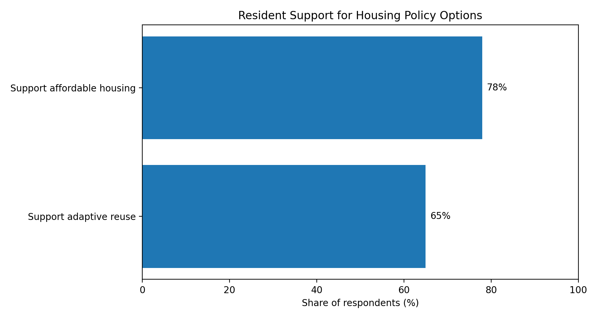

# Affordable Housing Policy Analysis

Policy research and survey-analysis case study on affordable housing, land use, adaptive reuse, and local master planning.

## Overview

This repository presents a sanitized public case study based on a local-government housing research initiative in Cobb County, Georgia.

The project focused on affordable housing, zoning, land use, master planning, adaptive reuse of underused commercial properties, and community engagement. The goal was to translate resident input and local planning concepts into practical policy recommendations for county and municipal leaders.

This public version includes only aggregate findings and sanitized summaries. It does not include raw survey responses, private communications, personal information, or internal government documents.


## Project context

As a Housing & Master Planning Intern for Cobb County District 2, I supported an initiative focused on housing affordability and land-use planning across six Metro Atlanta communities with a combined population exceeding 400,000 residents.

The work included:

- Designing and analyzing a resident survey
- Researching affordable housing and adaptive reuse policy options
- Translating planning concepts into public-facing explanations
- Supporting community education around zoning, land use, and master planning
- Delivering findings and recommendations to local-government leadership

## Key findings

The resident survey showed strong support for housing policy action:

- **78% of respondents supported affordable housing**
- **65% of respondents supported repurposing unused commercial properties**

These findings suggested that residents were open to practical housing solutions when framed around community needs, responsible planning, and better use of existing land and infrastructure.
## Data analysis artifact

This repository includes a small public-safe data analysis workflow using aggregate survey findings only.

**Input data:** [`data/survey_findings_aggregate.csv`](data/survey_findings_aggregate.csv)  
**Analysis script:** [`analysis/create_support_chart.py`](analysis/create_support_chart.py)  
**Generated chart:** [`visuals/survey_support_summary.png`](visuals/survey_support_summary.png)



To run the chart script locally:

```bash
pip install -r requirements.txt
python analysis/create_support_chart.py

## Policy themes

This project focused on several connected policy questions:

### Affordable housing

How can local governments support housing options for working families, young adults, seniors, and residents at risk of displacement?

### Adaptive reuse

How can underused commercial properties be repurposed for housing, mixed-use development, or community-serving uses?

### Land use and zoning

How do zoning rules, future land-use maps, and master plans shape what kinds of housing can be built?

### Community engagement

How can residents better understand planning tools and participate meaningfully in local housing decisions?

## What this repository includes

This public repository is intended to show the research process and policy-analysis approach, not to publish confidential working files.

Planned public materials include:

- Aggregate survey findings
- A sanitized policy brief
- A methodology note
- A community-session summary
- Charts showing public support for housing policy options
- Notes on privacy and responsible handling of civic data

## What is intentionally excluded

This repository does **not** include:

- Raw survey responses
- Individual respondent comments
- Names, emails, phone numbers, or addresses
- Private communications with public officials
- Internal county strategy documents
- Non-public working drafts
- Any information that could identify individual residents

## Skills demonstrated

- Public policy research
- Survey design and analysis
- Housing policy analysis
- Land-use and zoning research 
- Community engagement
- Policy communication
- Local-government workflow support
- Privacy-aware handling of civic data

## Why this belongs in my portfolio

This project shows how local policy work can connect research, resident input, planning concepts, and practical recommendations. It also reflects my broader interest in civic technology and public-interest problem solving: making complex public systems easier to understand, navigate, and improve.
